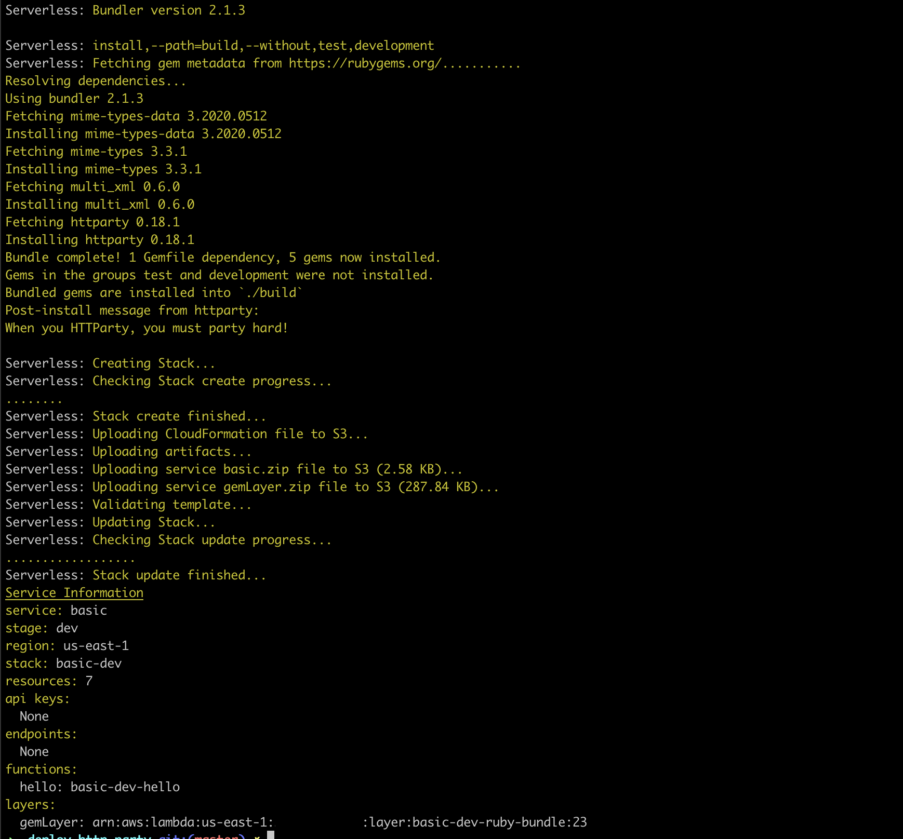

# Quick Start

## Install 

### Install Serverless

```bash
npm install -g serverless
```

Refer [here](https://www.serverless.com/framework/docs/getting-started/) for ⚡️ [serverless](https://www.serverless.com/) installation instructions.

### Configure your aws credentials


## A Simple Example

Let's check simple example to deploy httpparty gem to layer and use it in example function.

#### Checkout or Download this example project

```bash
  git clone https://github.com/navarasu/serverless-ruby-examples.git
```

#### Navigate to the project and install plugin 

```bash
 cd serverless-ruby-examples/deploy_http_party
 sls plugin install -n serverless-ruby-layer
```

#### Deploy example to AWS

```bash
 sls deploy
```

Running `sls deploy` automatically deploys the required gems as in Gemfile to AWS lambda layer and make the gems available to the `RUBY_PATH` of the functions `hello.handler`



###  Invoke AWS funtions to verify deployment

```bash
 sls invoke -f hello

```


  👍🎉 Great !!! You tried the simple example to deploy gems to AWS layer along with function 🎉👍.


For more usage and examples refer [here](https://navarasu.github.io/serverless-ruby-layer/#/usage_examples)

